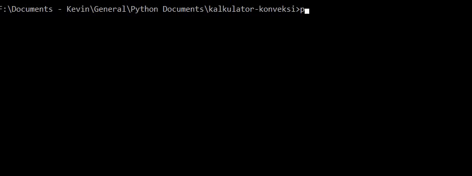

# Kalkulator Konveksi

Kalkulator untuk menghitung gaji karyawan konveksi. Saya mencoba membuat _script_ sederhana sebagai alternatif untuk membantu menghitung gaji usaha konveksi orang tua saya.

_Script_ ini dijalankan pada _shell_ dan hanya dapat menerima input dan menghitung data gaji untuk satu orang, sebelum sesi di-_reset_. Sesi akan terus meminta input (_infinite loop_) hingga terjadi masalah sistem atau diberikan perintah `exit`. Perintah dimasukkan sesuai format yang ditentukan. Entri pekerjaan menggunakan satuan lusin (dan satuan helai untuk sisa) untuk biayanya.

# Prasyarat Penggunaan
Berikut adalah prasyarat yang diperlukan pada sistem untuk dapat menggunakan _script_ ini.
- Python 3

# Cara Menggunakan



Pada bagian ini akan diuraikan perintah-perintah yang tersedia beserta contoh formatnya.

## Memulai _script_

_Script_ dijalankan dengan memanggilnya melalui _command line interface_ atau _shell_.
```bash
python main.py
```
Maka akan muncul antarmuka sederhana seperti ini.
```bash
=====================================
** Welcome to Konveksi Calculator! **

* Type 'help' and Enter to show available commands.
* Type 'exit' or 'quit' and Enter to exit..
=====================================
>>>
```

## Keluar dari sesi
Perintah `quit`, `exit`, `q`, dan `e` dapat digunakan untuk keluar dari sesi. Masukkan perintah kemudian tekan `Enter`/`Return` pada _keyboard_.
```
>>> quit

D:\kalkulator-konveksi>
```

## Memasukkan entri pekerjaan
Entri pekerjaan dimasukkan dengan format "`[lusin] [sisa] [harga per lusin]`". Contoh seperti di bawah ini untuk entri pekerjaan sebanyak `20` lusin lebih `3` helai dengan harga per lusin adalah `4000`.
```bash
>>> 20 3 4000
```

Jika tidak ada sisa helai, maka entri dapat dimasukkan dengan bilangan lusin dan harga saja.
```bash
>>> 20 4000
```

## Memberi nama karyawan
Nama dapat diberikan pada sesi yang sedang berlangsung. Nama akan tercantum saat perintah `total` dijalankan. Nama dimasukkan dengan perintah `name`, `nama`, atau `n` dengan format "`name [nama]`".
```bash
>>> name Kevin
```

## Menampilkan total gaji untuk seorang karyawan
Total diapat ditampilkan pada _shell_ dengan perintah `total` atau `t`.
```bash
>>> name Kevin
>>> 1 2 3000
>>> 2 3 4000
>>> 3 4 5000
>>> 4 5 6000
>>> 5 6 7000
>>> 6 7 8000
>>> 7 8 9000
>>> total
Nama: Kevin
No. | Lusin | Sisa |  Biaya  |  Subtotal
------------------------------------------
  1 |     1 |    2 |   3,000 |      3,500
  2 |     2 |    3 |   4,000 |      9,000
  3 |     3 |    4 |   5,000 |     16,666
  4 |     4 |    5 |   6,000 |     26,500
  5 |     5 |    6 |   7,000 |     38,500
------------------------------------------
  6 |     6 |    7 |   8,000 |     52,666
  7 |     7 |    8 |   9,000 |     69,000
------------------------------------------ +
                        Total:    215,833
>>>
```

## _Reset_ sesi yang berlangsung
Membersihkan sesi dapat dilakukan dengan perintah `reset` atau `r`. Perintah ini akan mengosongkan nama dan data gaji yang telah dimasukkan. Fungsi ini yang mendukung penggunaan 1 _script_ untuk berbagai karyawan secara bergantian.
```bash
>>> reset
============RESET============
>>> total
Nama:
No. | Lusin | Sisa |  Biaya  |  Subtotal
------------------------------------------
------------------------------------------ +
                        Total:          0
>>>
```

## Menghapus entri pekerjaan tertentu
Fitur ini digunakan untuk membatalkan ___n___ entri __terbaru__ dengan perintah `undo` atau `u`. Format penggunaannya adalah "`undo [jumlah entri]`".
```bash
>>> 1 2 3000
>>> 2 3 4000
>>> 3 4 5000
>>> 100 3 2000
>>> 5 6 7000
>>> undo 2
Removed 5 6 7000.
Removed 100 3 2000.
>>> total
Nama:
No. | Lusin | Sisa |  Biaya  |  Subtotal
------------------------------------------
  1 |     1 |    2 |   3,000 |      3,500
  2 |     2 |    3 |   4,000 |      9,000
  3 |     3 |    4 |   5,000 |     16,666
------------------------------------------ +
                        Total:     29,166
>>>
```
>Penghapusan dilakukan dengan iterasi data dari belakang.

# ToDo List
- Menambahkan perintah `help` yang komprehensif.
- Meningkatkan modularitas program.
- Memungkinkan menambahkan data karyawan yang berbeda tanpa me-_reset_ sesi.

# Author
Kevin Christian Chandra | __Kc-codetalker__